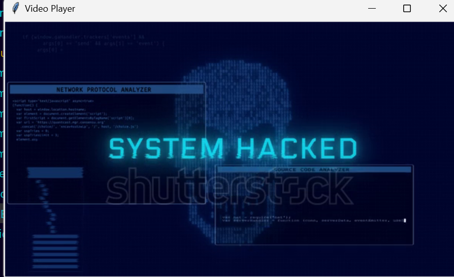
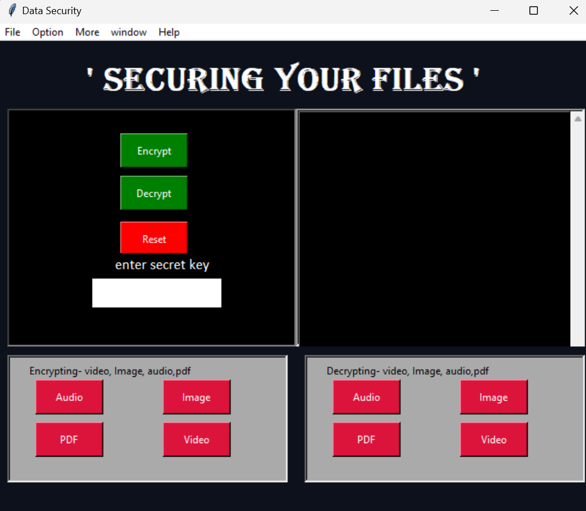
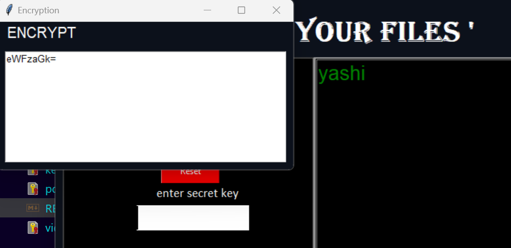
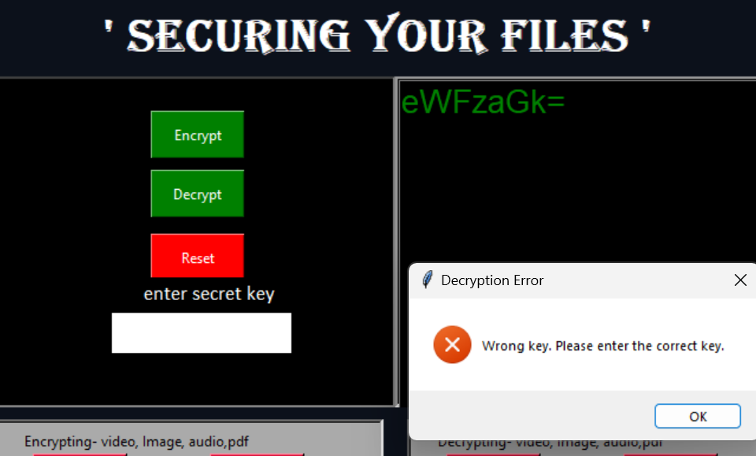
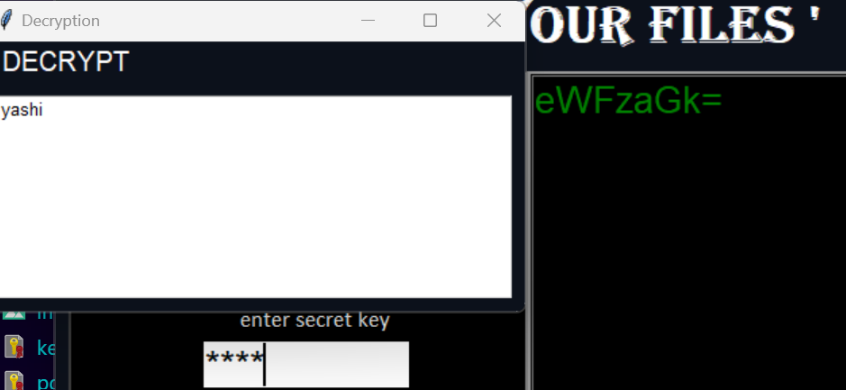

# File Encryption and Decryption Application

This Python-based application allows you to secure your files through encryption and decryption. It supports various file types, including audio, images, PDFs, and videos. Additionally, it features a simple text encryption functionality using Base64 encoding.

---

## Table of Contents
- [Requirements](#requirements)
- [Algorithms Used](#algorithms-used)
- [Key Generation](#key-generation)
- [Features](#features)
- [Usage](#usage)
- [Performance Metrics](#performance-metrics)
- [License](#license)

---

## Requirements

To run this application, ensure you have the following installed:

- **Python 3.x**: Make sure Python 3 is installed on your machine.
- **Required Python Libraries**:
  - `opencv-python`: for video processing
  - `Pillow`: for image processing
  - `cryptography`: for encryption and decryption
  - `tkinter`: for the GUI

You can install the required libraries using pip:

```bash
pip install opencv-python Pillow cryptography

```
## Algorithms Used
The application utilizes the following algorithms for encryption:
AES (Advanced Encryption Standard)
A symmetric encryption algorithm that encrypts data in fixed-size blocks (128 bits) using keys of 16, 24, or 32 bytes.
PKCS7 Padding: Ensures the data being encrypted is a multiple of the block size (16 bytes for AES).
Base64 Encoding: Used for simple text encryption.
Key Generation
The application generates a random 256-bit key (32 bytes) for AES encryption using the secrets module, which is suitable for cryptographic use. The key is saved to a file for later use during decryption.

## Features
Encrypt and Decrypt Audio Files: Supports .wav files.
Encrypt and Decrypt Image Files: Supports .jpeg, .jpg, and .png files.
Encrypt and Decrypt PDF Files: Supports .pdf files.
Encrypt and Decrypt Video Files: Supports .mp4, .avi, and .mkv files.
Text Encryption and Decryption: Simple Base64 encoding for text messages.
User-Friendly GUI: Built with Tkinter for easy interaction.
Usage
Running the Application
To execute the script, use the following command:

```bash

python your_script_name.py
```

##  Encrypting Files
Select the file type (Audio, Image, PDF, Video) from the GUI.
Choose the file you want to encrypt.
The application will generate a key and save it to a .key file.
Specify the save location for the encrypted file.
## Decrypting Files
Select the file type (Audio, Image, PDF, Video) from the GUI.
Choose the encrypted file.
The application will load the corresponding key from the .key file.
Specify the save location for the decrypted file.
## Text Encryption/Decryption
Enter a secret key in the provided field.
Enter the text you want to encrypt or decrypt.
Click the respective button to perform the action.
About Section
Access information about the application through the "Help" menu.

## Performance Metrics
Supports encryption and decryption of files up to 2 GB in size.
Uses AES with key sizes of 128, 192, or 256 bits for strong encryption.
AES-256 has a key space of 2^256, making it computationally infeasible to brute-force and secure against all known practical attacks, providing a security level equivalent to 128-bit security.
Supports encryption and decryption for 4 file types: Audio, Image, PDF, Video.
License
This project is licensed under the MIT License. You are free to use, modify, and distribute this software as long as you include the original license.

##Interface







